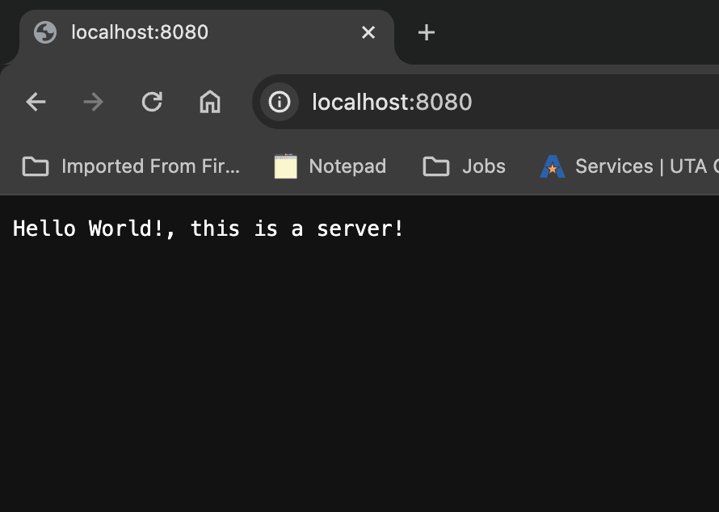

## In this blog, I would:

1. Create a Hello world Java server
2. Use NASA APOD API
3. User Joke.api to tell you jokes
4. And get 2 servers to talk to each other. A basic Chat application

<!-- https://apod.nasa.gov/apod/ -->

This blog is to show how people can work with simple APIs and socket using Java, and create a java server
from scratch and connect it to frontend.

### First we create a Hello world Java server.

```java
public class SimpleHttpServer {
    public static void main(String[] args) {
        int port = 8080; // You can change this to any available port

        try {
            ServerSocket serverSocket = new ServerSocket(port);
            System.out.println("Server listening on port " + port);

            while (true) {
                Socket clientSocket = serverSocket.accept();
                handleRequest(clientSocket);
            }
        } catch (IOException e) {
            e.printStackTrace();
        }
    }

    private static void handleRequest(Socket clientSocket) throws IOException {
        // try-with-resources statement introduced in Java 7
        try (
                Scanner in = new Scanner(clientSocket.getInputStream());
                PrintWriter out = new PrintWriter(clientSocket.getOutputStream(), true)) {
            // Read the HTTP request from the client
            while (in.hasNextLine()) {
                String line = in.nextLine();
                System.out.println("Client request: " + line);

                // Break when an empty line is encountered, signaling the end of the request
                if (line.isEmpty()) {
                    break;
                }
            }

            // Send a simple HTTP response back to the client
            String response = "HTTP/1.1 200 OK\r\nContent-Type: text/plain\r\n\r\nHello World!, this is a server!";
            out.println(response);
        }
        // Close the client socket
        clientSocket.close();
    }
}
```

Now, a small discussion for every module used in this code,

1. IOException:
   This module is used to handle Input/Output (IO) exceptions. In the context of the server,
   IO operations like reading from or writing to streams can throw IOExceptions.

2. PrintWriter:
   This module provides the capability to print formatted representations of objects to a
   text-output stream.

3. ServerSocket:
   This module provides a mechanism to listen for incoming connections on a specific port.

4. Socket:
   This module represents a socket, which is an endpoint for sending or receiving data across
   a computer network. In the server code, Socket is used to accept connections from clients.

5. Scanner:
   This module is used for parsing primitive types and strings using regular expressions.



- You can see the requests getting logged in the terminal.
  Now we can only send "GET" requests from the browser.

### Now we extend the server, to display pictures from the NASA ADOP API.

```java
public class NasaADOP {
    public static void main(String[] args) {
        int port = 8080;

        try {
            ServerSocket serverSocket = new ServerSocket(port);
            System.out.println("Server listening on port " + port);
            // Listen to in-comming connections
            while (true) {
                Socket clientSocket = serverSocket.accept();
                handleRequest(clientSocket);
            }

        } catch (IOException e) {
            e.printStackTrace();
        }
    }

    private static void handleRequest(Socket clientSocket) {
        try (
                Scanner in = new Scanner(clientSocket.getInputStream());
                PrintWriter out = new PrintWriter(clientSocket.getOutputStream(), true)) {
            // Read the HTTP request from the client
            while (in.hasNextLine()) {
                String line = in.nextLine();
                System.out.println("Client request: " + line);
                // Break when an empty line is encountered, end of the request
                if (line.isEmpty()) {
                    break;
                }
            }

            // Fetch image URL from NASA API
            String[] imageUrlAndDescription = getImageUrlFromNasaApi();

            if (imageUrlAndDescription.length == 2) {
                // Send an HTML response with the image tag
                String response = "HTTP/1.1 200 OK\r\nContent-Type: text/html\r\n\r\n" +
                        "<html><body><h2>Hello World!, this is today's APOD!</h2>" +
                        "\r" + imageUrlAndDescription[1]
                        + "</body></html>";
                out.println(response);
            } else {
                // Send an HTML response with the image tag
                String response = "HTTP/1.1 200 OK\r\nContent-Type: text/html\r\n\r\n" +
                        "<html><body><h2>Hello World!, Something broke!</h2>" +
                        "" + "At about 89,000 miles in diameter, Jupiter could swallow 1,000 Earths. It is the largest planet in the solar system and perhaps the most majestic." + </body></html>";
                out.println(response);
            }

        } catch (IOException e) {
            e.printStackTrace();
        } finally {
            // Close the client socket
            try {
                clientSocket.close();
            } catch (IOException e) {
                e.printStackTrace();
            }
        }
    }

    private static String[] getImageUrlFromNasaApi() {
        // Make an HTTP request to the NASA API to get the image URL
        // Replace this with your actual NASA API key and the correct API endpoint
        String apiKey = 'DEMO_KEY';
        String apiUrl = "https://api.nasa.gov/planetary/apod?api_key=" + apiKey;

        try (Scanner scanner = new Scanner(new URL(apiUrl).openStream())) {
            StringBuilder response = new StringBuilder();
            while (scanner.hasNextLine()) {
                response.append(scanner.nextLine());
            }

            // Parse the JSON response to get the image URL
            // This is a simplified example, you may want to use a JSON library for robust
            // parsing
            String responseString = response.toString();
            String description = responseString.split("\"explanation\":\"")[1].split("\"hdurl\"")[0];
            String imageUrl = responseString.split("\"url\":\"")[1].split("\",")[0];

            String[] returnArray = { imageUrl, description };

            return returnArray;

        } catch (IOException e) {
            e.printStackTrace();
            String[] empStrings = {};
            return empStrings;
        }
    }
}

```


Now, a small discussion for other module used in this code,

- URL:
  the URL class in Java provides a convenient and straightforward way to work with URLs,
  making it a valuable tool for tasks involving network resources and web services.

3. Integrate Joke.api to get jokes:

4. Now, lets try running 2 (you can run more) servers on the same port and make them talk to each other.
   Code is in:
   ServerA.java and ServerB.java

- BufferedReader: Used for reading text from a character-based input stream (e.g., reading messages from the client).
- InputStreamReader: Converts bytes into characters. In this context, it's used to wrap the InputStream from the Socket to create a BufferedReader for reading messages.

5. Now lets try running servers on different ports and make then talk to each other.

References:

1. 
2. 
